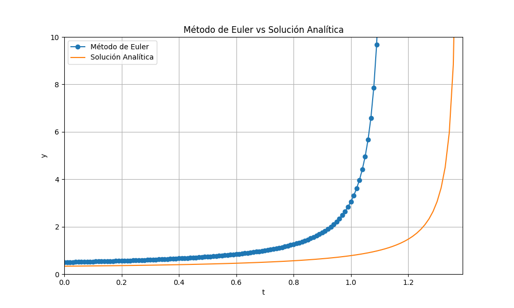
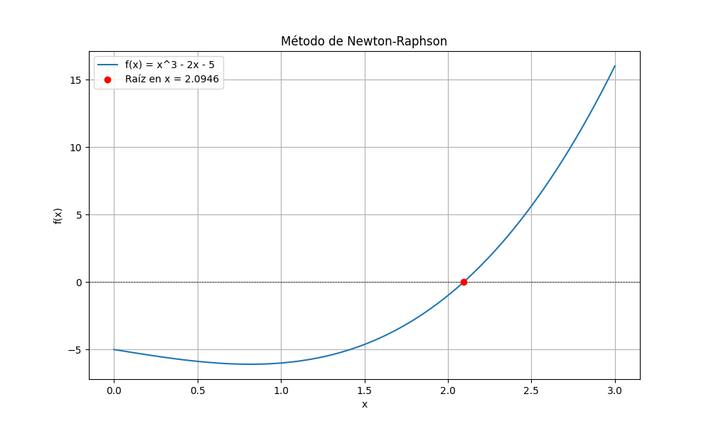

# Numerical Methods

Esta es una librería de métodos numéricos que incluye funciones para diferenciación, integración, interpolación y resolución de ecuaciones diferenciales, todas enseñadas y aplicadas en las clases de Física Computacional III.

Última actualización: 29/06/2024

## Instalación

Puedes clonar este repositorio y usar los scripts directamente.

```sh
git clone https://github.com/SPadillaC/numerical_methods.git
```

O simplemente descarga la carpeta con los métodos y pégala en la misma carpeta donde planeas programar las clases o tareas.

## ¿Cómo usar las funciones?

### Ejemplo de uso

```python

import numpy as np
import matplotlib.pyplot as plt
from numerical_methods import euler_method

# Definir la ecuación diferencial
def f(t, y):
    if y > 1e5:  # Limitar el valor de y para evitar overflow
        return np.inf
    return y**2 * np.exp(t)

# Condiciones iniciales
y0 = 0.5
t0 = 0
tf = 1.4  # Ajuste de límite superior
h = 0.01  # Reducir tamaño del paso

# Solución analítica
def analytical_solution(t):
    C = 1 / y0 + 2  # Ajuste basado en la condición inicial
    return 1 / (C - np.exp(t))

# Resolver la ecuación diferencial usando el método de Euler
t_values, y_values = euler_method(f, y0, t0, tf, h)

# Calcular la solución analítica
t_analytical = np.linspace(t0, tf, 100)
y_analytical = analytical_solution(t_analytical)

# Graficar las soluciones
plt.figure(figsize=(10, 6))
plt.plot(t_values, y_values, 'o-', label='Método de Euler')
plt.plot(t_analytical, y_analytical, '-', label='Solución Analítica')
plt.xlabel('t')
plt.ylabel('y')
plt.xlim([0, 1.39])
plt.ylim([0, 10])
plt.title('Método de Euler vs Solución Analítica')
plt.legend()
plt.grid(True)
plt.show()
```



### Otro ejemplo de uso

```python

import numpy as np
import matplotlib.pyplot as plt
from numerical_methods import euler_method

# Definir la ecuación diferencial
def f(t, y):
    if y > 1e5:  # Limitar el valor de y para evitar overflow
        return np.inf
    return y**2 * np.exp(t)

# Condiciones iniciales
y0 = 0.5
t0 = 0
tf = 1.4  # Ajuste de límite superior
h = 0.01  # Reducir tamaño del paso

# Solución analítica
def analytical_solution(t):
    C = 1 / y0 + 2  # Ajuste basado en la condición inicial
    return 1 / (C - np.exp(t))

# Resolver la ecuación diferencial usando el método de Euler
t_values, y_values = euler_method(f, y0, t0, tf, h)

# Calcular la solución analítica
t_analytical = np.linspace(t0, tf, 100)
y_analytical = analytical_solution(t_analytical)

# Graficar las soluciones
plt.figure(figsize=(10, 6))
plt.plot(t_values, y_values, 'o-', label='Método de Euler')
plt.plot(t_analytical, y_analytical, '-', label='Solución Analítica')
plt.xlabel('t')
plt.ylabel('y')
plt.xlim([0, 1.39])
plt.ylim([0, 10])
plt.title('Método de Euler vs Solución Analítica')
plt.legend()
plt.grid(True)
plt.show()
```



### Ejemplo de uso con múltiples métodos

```python

import numpy as np
import matplotlib.pyplot as plt
from numerical_methods import central_difference, integral_riemann, integral_trapezoidal

# Definir la función a derivar e integrar
def f(x):
    return np.cos(x)

# Punto en el que se calculará la derivada
x = np.pi / 4

# Calcular la derivada central
derivada_central = central_difference(f, x)
print(f"La derivada central de f(x) en x={x} es: {derivada_central}")

# Definir los límites de integración
a = 0
b = np.pi / 2
n = 1000  # número de subintervalos

# Calcular la integral usando los métodos de Riemann y trapezoidal
I_riemann = integral_riemann(f, a, b, n)
I_trapezoidal = integral_trapezoidal(f, a, b, n)

print(f"La integral calculada numéricamente con el método de Riemann es: {I_riemann}")
print(f"La integral calculada numéricamente con el método trapezoidal es: {I_trapezoidal}")
```

### Si no recuerdan cómo usar un método, o qué argumentos tiene la función, pueden hacer lo siguiente

```python

from numerical_methods import integral_simpson

help(integral_simpson)
```

### Esto les va a devolver

```md
Help on function integral_simpson in module numerical_methods.integration:

integral_simpson(f, a, b, n)
    Calcula la integral definida de una función f en el intervalo [a, b] utilizando la regla de Simpson.

    Parámetros:
    f : función
        La función a integrar.
    a : float
        El límite inferior de integración.
    b : float
        El límite superior de integración.
    n : int
        El número de subintervalos en los que se divide [a, b]. Debe ser par.

    Retorna:
    float
        La aproximación de la integral de f en [a, b].

    Ejemplo de uso:
    >>> def f(x):
    >>>     return x**2
    >>> integral_simpson(f, 0, 1, 100)
    0.33333333333333337
```

Si encuentran cualquier error en alguna de las funciones, por favor háganmelo saber.
